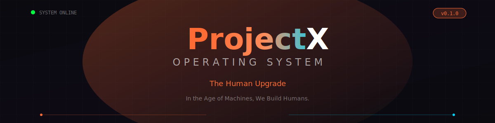

<p align="center">This is a [Next.js](https://nextjs.org) project bootstrapped with [`create-next-app`](https://nextjs.org/docs/app/api-reference/cli/create-next-app).

  

</p>## Getting Started


<h1 align="center">🚀 ProjectX OS</h1>First, run the development server:


<p align="center">```bash

  <strong>The Human Upgrade • A Learning Operating System</strong>npm run dev

</p># or

yarn dev

<p align="center"># or

  <em>In the Age of Machines, We Build Humans.</em>pnpm dev

</p># or

bun dev

<p align="center">```

  <a href="#features">Features</a> •

  <a href="#demo">Demo</a> •Open [http://localhost:3000](http://localhost:3000) with your browser to see the result.

  <a href="#getting-started">Getting Started</a> •

  <a href="#tech-stack">Tech Stack</a> •You can start editing the page by modifying `app/page.tsx`. The page auto-updates as you edit the file.

  <a href="#architecture">Architecture</a> •

  <a href="#contributing">Contributing</a>This project uses [`next/font`](https://nextjs.org/docs/app/building-your-application/optimizing/fonts) to automatically optimize and load [Geist](https://vercel.com/font), a new font family for Vercel.

</p>

## Learn More

<p align="center">

  To learn more about Next.js, take a look at the following resources:

  

  - [Next.js Documentation](https://nextjs.org/docs) - learn about Next.js features and API.

  - [Learn Next.js](https://nextjs.org/learn) - an interactive Next.js tutorial.

  

</p>You can check out [the Next.js GitHub repository](https://github.com/vercel/next.js) - your feedback and contributions are welcome!


<p align="center">## Deploy on Vercel

  

  The easiest way to deploy your Next.js app is to use the [Vercel Platform](https://vercel.com/new?utm_medium=default-template&filter=next.js&utm_source=create-next-app&utm_campaign=create-next-app-readme) from the creators of Next.js.

  

</p>Check out our [Next.js deployment documentation](https://nextjs.org/docs/app/building-your-application/deploying) for more details.


---

## ✨ What is ProjectX OS?

**ProjectX OS** is a revolutionary learning operating system that transforms education from passive consumption to active capability building. Instead of watching videos and taking tests, learners work on real **missions**, earn **XP**, and build verified **portfolios** that prove what they can actually do.

### The Four Phases

| Phase | Focus | Description |
|-------|-------|-------------|
| 🟠 **eXperience** | LEARN | Give humans a chance to experience the future today |
| 🔵 **eXperiment** | WORK | Let humans experiment, collaborate, and simulate real work |
| 🟣 **eXcel** | EARN | Turn capability into value through verified credentials |
| 🔴 **eXpand** | INVENT | Multiply impact across regions, cultures, and systems |

---

## 🎬 Demo

<p align="center">
  
</p>

### Screenshots

<table>
  <tr>
    <td width="50%">
      
      <p align="center"><strong>Landing Page</strong></p>
    </td>
    <td width="50%">
      
      <p align="center"><strong>OS Desktop Mode</strong></p>
    </td>
  </tr>
  <tr>
    <td width="50%">
      
      <p align="center"><strong>Student Dashboard</strong></p>
    </td>
    <td width="50%">
      
      <p align="center"><strong>Teacher Dashboard</strong></p>
    </td>
  </tr>
  <tr>
    <td width="50%">
      
      <p align="center"><strong>Mission View</strong></p>
    </td>
    <td width="50%">
      
      <p align="center"><strong>Teacher Review Queue</strong></p>
    </td>
  </tr>
</table>

---

## 🚀 Features

### For Students
- 📋 **Mission-Based Learning** - Complete real-world projects, not passive courses
- ⚡ **XP & Leveling System** - Track progress with gamified progression
- 🏆 **Verified Badges** - Earn credentials that prove capability
- 📁 **Portfolio Builder** - Showcase work that matters
- 🤖 **AI Mentor (Orb)** - Get guidance from an intelligent assistant

### For Teachers
- 📝 **Review Queue** - Efficiently evaluate student submissions
- 👥 **Student Management** - Track and support assigned learners
- 📊 **Progress Analytics** - Monitor cohort performance
- 🎯 **Mission Assignment** - Assign and customize learning paths

### For Schools
- 🏫 **Multi-Tenant Architecture** - Isolated data per institution
- 📈 **Impact Reports** - Measure learning outcomes
- 👨‍💼 **Admin Dashboard** - Manage users, cohorts, and content
- 🔒 **RBAC Security** - Role-based access control

### Technical Highlights
- ⚡ **Next.js 16** with React 19 and Turbopack
- 🎨 **Cyberpunk Aesthetic** with smooth Framer Motion animations
- 📱 **Responsive Design** - Works on all devices
- 🔐 **Type-Safe** - Full TypeScript coverage
- 🧪 **E2E Testing** with Playwright

---

## 🛠️ Tech Stack

| Category | Technology |
|----------|------------|
| **Framework** | Next.js 16 (App Router) |
| **Language** | TypeScript 5 |
| **Styling** | Tailwind CSS 4 |
| **Animations** | Framer Motion 12 |
| **State** | Zustand |
| **Icons** | Lucide React |
| **Testing** | Playwright |
| **Deployment** | Vercel |

---

## 📦 Getting Started

### Prerequisites

- Node.js 18+ 
- npm, yarn, or pnpm

### Installation

```bash
# Clone the repository
git clone https://github.com/ankityadavv2014/projectx-os.git
cd projectx-os

# Install dependencies
npm install

# Start development server
npm run dev
```

Open [http://localhost:3000](http://localhost:3000) to see the app.

### Quick Login (Demo Mode)

Click "Enter the Experience" on the landing page, then use Quick Access buttons to log in as:
- 🎓 **Student** - Experience missions and earn XP
- 👩‍🏫 **Teacher** - Review submissions and manage students
- 🏫 **School Admin** - Manage users and content
- ⚡ **Super Admin** - Full system access

---

## 🏗️ Architecture

```
projectx-os/
├── src/
│   ├── app/                 # Next.js App Router pages
│   │   ├── (auth)/          # Auth-required routes
│   │   ├── student/         # Student dashboard
│   │   ├── teacher/         # Teacher dashboard
│   │   ├── admin/           # Admin panel
│   │   └── os/              # OS Desktop experience
│   │
│   ├── components/          # React components
│   │   ├── landing/         # Landing page sections
│   │   ├── ui/              # Reusable UI components
│   │   └── ai/              # AI Assistant (Orb)
│   │
│   ├── lib/                 # Core libraries
│   │   ├── auth/            # Authentication & RBAC
│   │   ├── domain/          # Business logic & stores
│   │   └── analytics/       # Event tracking
│   │
│   └── types/               # TypeScript definitions
│
├── docs/                    # Documentation
├── agents/                  # AI Agent prompts
└── tests/                   # E2E tests
```

---

## 📖 Documentation

| Document | Description |
|----------|-------------|
| [Architecture](docs/ARCHITECTURE.md) | System design and patterns |
| [Data Model](docs/DATA-MODEL.md) | Entity relationships |
| [RBAC](docs/RBAC.md) | Role-based access control |
| [UX Flows](docs/UX-FLOWS.md) | User journey maps |
| [Deployment](docs/DEPLOYMENT.md) | Production setup |

---

## 🤝 Contributing

We welcome contributions! Please see our [Contributing Guide](CONTRIBUTING.md) for details.

1. Fork the repository
2. Create your feature branch (`git checkout -b feature/amazing-feature`)
3. Commit your changes (`git commit -m 'Add amazing feature'`)
4. Push to the branch (`git push origin feature/amazing-feature`)
5. Open a Pull Request

---

## 📄 License

This project is licensed under the MIT License - see the [LICENSE](LICENSE) file for details.

---

## 🙏 Acknowledgments

- Built with ❤️ in India
- Inspired by the belief that education should prove capability, not just completion
- Thanks to all contributors and early adopters

---

<p align="center">
  <strong>The Human Upgrade</strong><br/>
  <em>Built by The ProjectX Co.</em>
</p>

<p align="center">
  <a href="https://projectx.school">Website</a> •
  <a href="https://twitter.com/projectxos">Twitter</a> •
  <a href="https://discord.gg/projectx">Discord</a>
</p>
